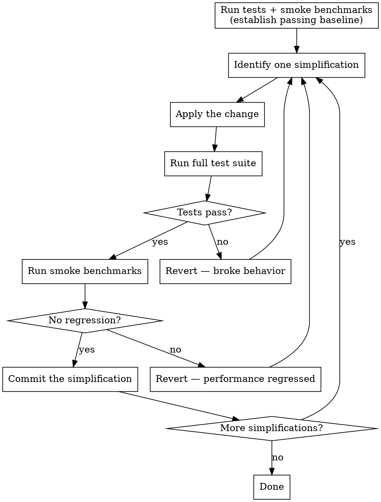

# Code Optimizer

## Overview

Simplify and restructure code while preserving exact behavior. Every change must be verified by tests and benchmarks — no regressions allowed.

**Core principle:** Simpler code is better code. If the logic doesn't change, the tests and benchmarks shouldn't either.

## When to Use

- Asked to simplify, clean up, or refactor code
- Code has grown complex and needs restructuring
- Duplicate logic exists across functions
- Dead code or unused constants accumulate

**When NOT to use:**
- Changing behavior or adding features (that's implementation work)
- Performance optimization that changes algorithms (use `perf-optimizer`)

## Workflow



## Before Starting

Run the full test suite and smoke benchmarks to confirm a clean baseline:

```bash
./gradlew allTests
./gradlew :benchmarks:jvmSmokeBenchmark
./gradlew :benchmarks:macosArm64SmokeBenchmark
```

If anything fails before you start, stop and report — do not simplify on a broken baseline.

## Simplifications

Apply one simplification at a time. After each, run tests then benchmarks.

### Inline Single-Use Functions
If a function is called from exactly one place, inline its body at the call site. This eliminates indirection and makes the code easier to follow. Before inlining, verify with a search that it truly has only one caller.

### Extract Duplicate Logic
When the same logic appears in multiple places, extract it into a shared function. The shared function should have a clear name that describes what it does. Callers should become simpler after extraction.

### Remove Redundant Constants
Constants that duplicate other constants, or that are used only once and don't improve readability, should be removed. Keep constants that name magic values or are used in multiple places.

### Remove Unused Code
Functions, variables, and imports that are never referenced should be deleted. Verify with a search before removing — "unused" in one file may be used in another.

### Use Function Overloading
Where multiple functions perform the same operation with different parameter types, use function overloading (same name, different signatures) instead of distinct function names.

### Split Large Files
When a file exceeds 500 lines and contains multiple distinct concerns, split it into separate files grouped by type. **Exception:** if the file is a single class, keep it together.

Split by responsibility, for example:
- Response models in their own file
- Request models in their own file
- Database access functions in their own file
- Validation logic in its own file
- Mapping/conversion functions in their own file

Each resulting file should have a cohesive purpose — a reader should be able to guess what's in it from the filename alone.

## Code Ordering

Functions should be ordered **parent-to-child** (top-down):

1. **Public API** — entry points at the top
2. **Internal helpers** — called by the public API
3. **Low-level utilities** — leaf functions that don't call other functions in the file

This means: if function `A` calls function `B`, then `A` appears above `B`. A reader can follow the code top-down without jumping around.

## Readability Rules

- **Keep existing comments** that explain *why*, not *what*. Don't strip comments for brevity.
- **Don't rename** variables or functions unless the current name is misleading. Familiarity has value.
- **Don't restructure** control flow (e.g., invert if/else, convert to when) unless it measurably simplifies.
- **Preserve whitespace grouping** — blank lines between logical sections help readability.

## Verification

**When function bodies are changed** (inlining, extracting, removing code): tests and benchmarks are mandatory after each change.

1. Run the full test suite: `./gradlew allTests`
2. Run smoke benchmarks: `./gradlew :benchmarks:jvmSmokeBenchmark` / `macosArm64SmokeBenchmark`
3. If either regresses, revert immediately and try a different simplification
4. If both pass, commit with a message describing what was simplified and why

**When only moving functions, classes, or types around** (reordering within a file, splitting files, relocating between files without changing any body): tests and benchmarks can be skipped. Just verify compilation succeeds.

## Common Mistakes

| Mistake | Fix |
|---------|-----|
| Batching multiple simplifications | One change at a time — isolate the effect |
| Removing "unused" code without searching | Always grep/search before deleting |
| Inlining a function used in multiple places | Only inline single-use functions |
| Stripping comments during cleanup | Keep comments that explain intent |
| Reordering code without checking dependencies | Follow parent-to-child, verify compilation |
| Skipping benchmarks after "safe" changes | Any structural change can affect performance |
