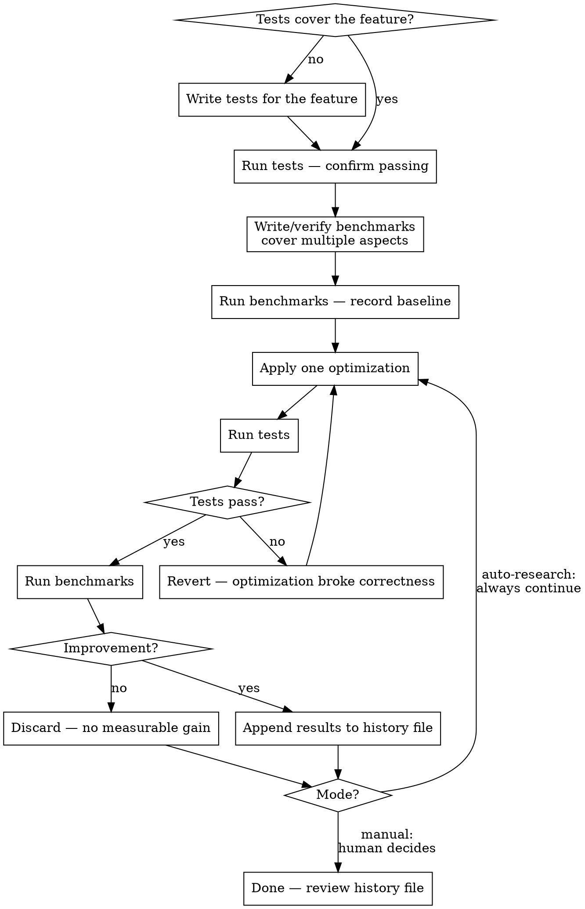

# Performance Optimizer

## Overview

Performance optimization is a disciplined, evidence-based process. Every optimization must be **measured**, not assumed. No code change ships without proof it improved performance and didn't break correctness.

**Core principle:** Tests prevent regressions. Benchmarks prove improvements. Both run after every change.

## When to Use

- Asked to optimize, speed up, or improve performance of a feature
- Profiling or benchmarks reveal a hot path
- A benchmark regression is detected
- Refactoring code for efficiency

**When NOT to use:**
- Adding new features (optimize later, after it works)
- Fixing correctness bugs (fix first, optimize second)

## Workflow

Two modes share the same core loop. **Manual mode** checks with the human between iterations. **Auto-research mode** runs autonomously until interrupted.



## Phase 1: Test Coverage

Before touching any implementation code, ensure the feature under optimization has thorough test coverage. Tests are your regression safety net — without them, you cannot know if an optimization broke something.

- Run existing tests: `./gradlew allTests`
- If the feature lacks tests, **write them first**
- Tests must cover edge cases and negative cases, not just the happy path

## Phase 2: Benchmark Coverage

Benchmarks must exercise **multiple aspects** of the feature to ensure full coverage. A single benchmark measuring one operation is not enough — an optimization might speed up one path while slowing another.

Example: optimizing `BigInteger` multiplication should benchmark:
- Small × small operands
- Small × large operands
- Large × large operands
- Repeated multiplications (loop/accumulator patterns)
- Multiplication combined with other operations (add-then-multiply chains)

Use the project's benchmarking harness. Per-suite tasks are available (e.g., `./gradlew :benchmarks:jvmArithmeticBenchmark`). Use smoke variants during iteration, full variants for final measurement.

## Phase 3: Establish Baseline

Run the benchmarks **before any optimization** and save the results to a file. This is the baseline all future runs are compared against.

```
# File: perf-results/<feature>-optimization-log.txt

=== BASELINE — <date> ===
<full benchmark output>
```

## Phase 4: Optimize → Test → Benchmark → Record

For **each** optimization:

1. **Apply one change** — keep optimizations atomic so you know what helped
2. **Run tests** — if any test fails, revert immediately; the optimization is invalid. If you discover a **bug** during optimization work (existing or introduced), fix it and add a regression test that reproduces the bug before continuing.
3. **Run benchmarks** — compare against the previous run
4. **Record results** — if the benchmark improved, **append** the new results to the history file with a description of what changed

```
=== RUN 2 — <date> ===
Change: replaced repeated allocation with cached constant for ZERO/ONE
<full benchmark output>
Delta: add() +12% faster, multiply() unchanged
```

Every improving run is appended so the file shows the **full history of incremental gains**. Runs that showed no improvement or regressions should be noted briefly but the code change discarded.

### Constraints

- **One optimization per loop iteration.** Keep changes atomic and reviewable.
- **Never skip tests.** A fast but incorrect implementation is worthless.
- **Never modify tests or benchmarks to make results look better.** The evaluation logic is immutable.
- **Prefer the smoke benchmark profile** during iteration (faster feedback). Use the full benchmark profile only for final validation.
- **Log honestly.** Record failed attempts briefly. Only append full results for genuine improvements.
- **Commit each improvement separately** with a descriptive message explaining what changed and why.

## What to Look For

### N+1 Calls and Redundant Work
Avoid patterns where an operation that could be done once is repeated `n + 1` times. Batch work, precompute results, or restructure loops to eliminate redundant calls.

### Minimize Allocations
- Use **constants** for commonly used values (ZERO, ONE, TEN) instead of creating new instances
- **Reuse variables** instead of allocating new objects on each iteration
- Add **caching** for expensive computations that are called repeatedly with the same inputs
- Prefer in-place mutation over copy-and-modify when the API allows it

### Use Optimal Algorithms
- Know the algorithmic complexity of what you're using — replace O(n²) with O(n log n) where possible
- Use specialized algorithms for known patterns (e.g., exponentiation by squaring instead of repeated multiplication, Karatsuba for large number multiplication)
- Profile first to confirm the bottleneck before swapping algorithms

### Minimize Network and IO Calls
- **Never** perform network or IO inside a loop if it can be batched or hoisted out
- Prefer bulk/batch APIs over per-item calls
- Cache IO results when the data doesn't change between iterations
- Consider lazy loading — don't read what you won't use

### Native BigInteger–Specific

These apply specifically to the LibTomMath-backed native implementation:

- **Reduce FFI call count** — Each Kotlin/Native → LibTomMath cinterop call has overhead. Combine multi-step operations into single calls. Example: `mp_add_d` instead of constructing a BigInteger(1) and calling `mp_add`.
- **Add fast paths for edge cases** — Operations with ZERO/ONE can short-circuit without calling LibTomMath. Self-operations (subtract self, divide self) have known results. Guard with cheap checks (signum, reference equality).
- **Use optimal LibTomMath functions** — Single-digit variants (`mp_add_d`, `mp_sub_d`, `mp_mul_d`, `mp_div_d`) are faster than multi-precision equivalents. `mp_div` returns both quotient and remainder — don't call it twice. Use in-place variants where available.
- **Reduce sign-handling overhead** — The native implementation translates between sign-magnitude and two's complement for bitwise operations. Look for redundant sign checks, conversions that can be simplified, and cases where the sign is known statically.
- **Prefer simpler code** — A 0.001 us/op improvement that adds 20 lines of complex code is not worth it. Deleting code that enables the same performance is ideal.

## Auto-Research Mode

Autonomous optimization loop (Karpathy-style autoresearch). Follows the same workflow above but runs continuously without human intervention.

### Scope

**You may modify:**
- `bignum/src/nativeMain/kotlin/io/github/artificialpb/bignum/BigInteger.native.kt`
- `bignum/src/jvmMain/kotlin/io/github/artificialpb/bignum/BigInteger.jvm.kt` (only if a native change requires a matching JVM change for API parity)

**You must NEVER modify:**
- Tests (`commonTest`, `nativeTest`, `jvmTest`)
- Benchmarks (`benchmarks/`)
- Build files (`build.gradle.kts`, `settings.gradle.kts`, `libs.versions.toml`)

### Setup

1. **Branch** — Create `autoresearch/<date>` from the current branch. Verify it doesn't already exist.
2. **Read context** — Read the mutable source files and `CLAUDE.md`.
3. **Review prior work** — Read all files in `perf-results/`. Do not re-attempt applied optimizations.
4. **Pick a target suite** — `arithmetic`, `bitwise`, `comparison`, `construction`, `conversion`, `numberTheory`, or `range`. Prefer suites with no log or remaining headroom.
5. **Establish baseline** — Run `./gradlew :benchmarks:macosArm64<Suite>SmokeBenchmark`, parse JSON from `benchmarks/build/reports/benchmarks/`, write baseline to `perf-results/<suite>-optimization-log.txt`.
6. **Confirm setup** — Verify tests pass: `./gradlew macosArm64Test`. If they fail, stop and report.

### Running

Execute Phase 4 in a continuous loop. **Do NOT pause to ask the human.** Continue until manually interrupted.

On test failure: `git checkout -- .`, note the failure, try a different optimization.
On improvement: `git commit`, append results to the log file.
On no improvement: `git checkout -- .`, note what didn't work.

### When You Run Out of Ideas

Do not stop. Instead:
- Re-read the source file for patterns you missed
- Look at functions you haven't optimized yet
- Combine two near-successful attempts
- Study the LibTomMath API (`tommath.h`) for functions that could replace multi-step wrapper logic
- Switch to a different benchmark suite
- Review "What to Look For" with fresh eyes

## Common Mistakes

| Mistake | Fix |
|---------|-----|
| Optimizing without benchmarks | Always measure. Intuition is unreliable. |
| Optimizing without tests | You'll ship a fast but broken feature. |
| Changing multiple things at once | One change per cycle — isolate the effect. |
| Only benchmarking the happy path | Cover multiple input sizes and operation mixes. |
| Discarding baseline numbers | Always keep the full history file. |
| Micro-optimizing cold paths | Profile first. Optimize the hot path. |
| Premature algorithm swap | Verify the simpler version is actually the bottleneck. |
